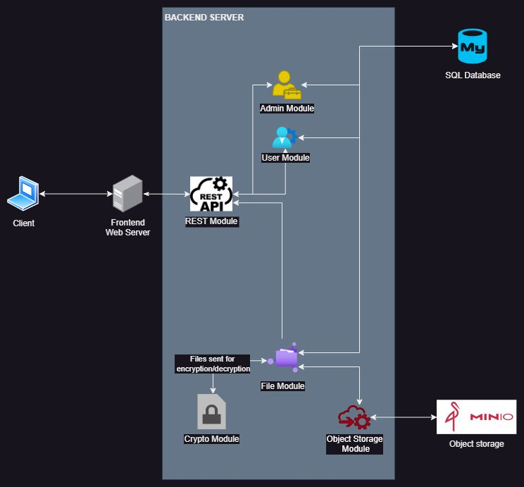
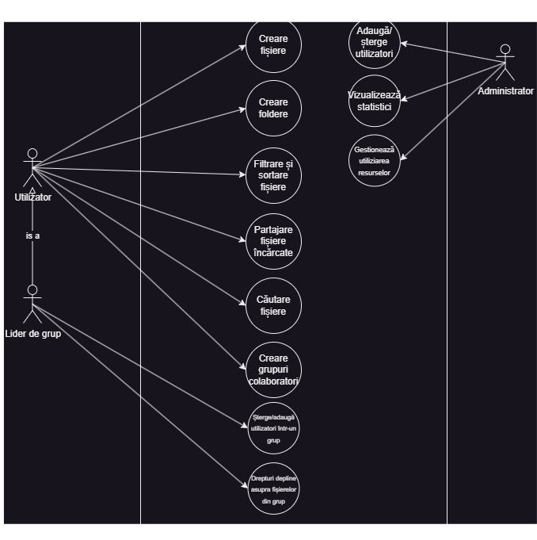
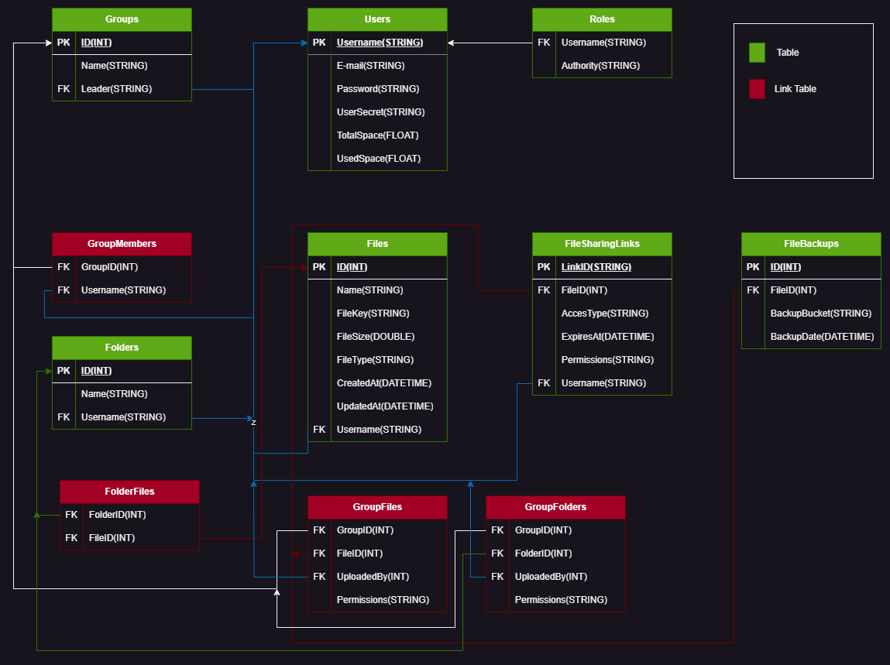

# Proiect_AWBD — Platformă de Partajare a Fișierelor

O aplicație web de tip **partajare de fișiere / cloud storage**, găzduită local. Utilizatorii se
înregistrează, primesc o cotă de stocare și pot încărca, organiza, partaja și face backup
fișierelor lor. Un panou de administrare dedicat gestionează utilizatorii, alocarea spațiului,
backup-urile și statisticile platformei.

---

## Cuprins

- [Descrierea proiectului](#descrierea-proiectului)
- [Arhitectură](#arhitectură)
- [Tehnologii folosite](#tehnologii-folosite)
- [Instrucțiuni de instalare](#instrucțiuni-de-instalare)
- [Documentația API](#documentația-api)
- [Capturi de ecran și diagrame](#capturi-de-ecran-și-diagrame)
- [Testare](#testare)
- [Contribuțiile membrilor echipei](#contribuțiile-membrilor-echipei)

---

## Descrierea proiectului

Proiect_AWBD este o platformă în stil Google Drive care permite utilizatorilor înregistrați să
stocheze și să își gestioneze fișierele în cloud. Fiecare utilizator are un spațiu personal cu o
cotă alocată; fișierele pot fi organizate în foldere imbricate, partajate prin link-uri cu
expirare, grupate pentru acces în echipă și recuperate din coșul de gunoi. Administratorii au un
panou separat pentru a gestiona utilizatorii, a aloca spațiu de stocare și a inspecta statisticile
de utilizare.

### Funcționalități

- **Conturi și autentificare** — înregistrare/autentificare pentru utilizatori și o autentificare
  separată pentru administrator, securizate cu JWT (Spring Security, sesiuni stateless, parole
  criptate cu BCrypt).
- **Fișiere** — încărcare, descărcare, redenumire, mutare, ștergere și căutare. Conținutul binar
  este stocat în MinIO (object storage compatibil S3); metadatele sunt în MySQL.
- **Foldere** — organizarea fișierelor în foldere imbricate (creare de subfoldere, mutare,
  ștergere, navigare în conținut).
- **Link-uri de partajare** — generarea de link-uri partajabile (cu tip de acces, permisiuni și
  dată de expirare) pentru a oferi acces la un fișier anume. Link-urile expirate sunt curățate de
  un task programat (scheduler).
- **Grupuri** — crearea de grupuri și adăugarea/eliminarea membrilor pentru partajare în echipă.
- **Cote de stocare** — fiecare utilizator are un spațiu alocat; consumul este urmărit, iar
  administratorul poate aloca spațiu suplimentar.
- **Backup-uri** — utilizatorii și administratorii pot crea și vizualiza backup-uri ale fișierelor.
- **Coș de gunoi (Trash)** — fișierele șterse ajung într-o zonă recuperabilă.
- **Panou de administrare** — gestionarea utilizatorilor (creare/ștergere), alocarea spațiului,
  vizualizarea backup-urilor și statistici cu grafice.

---

## Arhitectură

Trei niveluri (tiers) — doar serviciile de date rulează în Docker; aplicația în sine rulează
nativ.

| Nivel             | Tehnologie                       | Locație         | Port        |
|-------------------|----------------------------------|-----------------|-------------|
| Frontend          | React (Create React App)         | `frontend/`     | 3000        |
| Backend           | Spring Boot 4 (Java 25, Maven)   | `backend/`      | 8080        |
| Bază de date      | MySQL (Docker)                   | `database.yaml` | 3306        |
| Object storage    | MinIO (Docker)                   | `database.yaml` | 9000 / 9001 |

```
┌──────────────┐        REST / JWT        ┌──────────────────┐
│   Frontend   │  ───────────────────▶    │     Backend      │
│ React (3000) │  ◀───────────────────    │ Spring Boot(8080)│
└──────────────┘                          └────────┬─────────┘
                                                    │
                              ┌─────────────────────┼─────────────────────┐
                              │                                            │
                         JPA / JDBC                                  MinIO SDK
                              ▼                                            ▼
                     ┌────────────────┐                          ┌────────────────┐
                     │  MySQL (3306)  │                          │  MinIO (9000)  │
                     │  metadate,     │                          │  conținut      │
                     │  useri, cote   │                          │  binar (S3)    │
                     └────────────────┘                          └────────────────┘
```

**Stratificarea backend-ului:** `controller → service → repository (Spring Data JPA) → MySQL`,
cu un `ObjectStorageService` separat care comunică cu MinIO pentru conținutul binar. Securitatea
este aplicată printr-un `JwtAuthorizationFilter` plasat înaintea filtrului de autentificare al
Spring, plus verificări la nivel de metodă cu `@PreAuthorize` pentru endpoint-urile de admin.

Diagramele de arhitectură și de model de date se găsesc în [`Documentatie/`](Documentatie/) — vezi
[Capturi de ecran și diagrame](#capturi-de-ecran-și-diagrame).

---

## Tehnologii folosite

**Backend**
- Java 25, Spring Boot 4.0.6 (Web, Data JPA, Security)
- MySQL (`mysql-connector-j`), Hibernate (`ddl-auto=update`)
- MinIO Java SDK 8.5.3 (object storage)
- JJWT 0.11.5 (emitere/validare token-uri JWT)
- JUnit 5 + Mockito + H2 (teste), JaCoCo (acoperire cod)

**Frontend**
- React 18, React Router 7, Create React App
- Axios (HTTP), `jwt-decode`, `js-cookie`
- MUI 6, React-Bootstrap / Bootstrap 5, FontAwesome / react-icons
- Chart.js + react-chartjs-2, react-circular-progressbar

**Infrastructură**
- Docker Compose (MySQL + MinIO)

---

## Instrucțiuni de instalare

### Cerințe preliminare

- JDK 25
- Node.js + npm
- Docker (cu Docker Compose)

### 1. Pornirea serviciilor de date (MySQL + MinIO)

```bash
docker compose -f database.yaml up -d
# pentru oprire:
docker compose -f database.yaml down
```

Acest pas pornește:
- **MySQL** pe portul `3306` (baza de date `file_sharing_database`, utilizator `backend`).
  Scriptul `init.sql` acordă privilegiile necesare utilizatorului `backend` la pornire.
- **MinIO** pe `9000` (API) și `9001` (consolă web). Credențiale implicite pentru consolă:
  `minioadmin` / `minioadmin123`.

### 2. Pornirea backend-ului

Din `backend/` (necesită JDK 25):

```bash
./mvnw spring-boot:run
```

Backend-ul ascultă pe **http://localhost:8080**. Configurarea se află în
`backend/src/main/resources/application.properties`.

> **Cont admin implicit:** `admin` / `changeme`
> Poate fi suprascris prin variabilele de mediu `ADMIN_USERNAME`, `ADMIN_PASSWORD` și
> `ADMIN_EMAIL`. Un `AdminInitializer` creează contul de admin la prima pornire.

### 3. Pornirea frontend-ului

Din `frontend/`:

```bash
npm install
npm start
```

Apoi deschide **http://localhost:3000**.

---

## Documentația API

Toate endpoint-urile au prefixul `/api/v1`. Autentificarea folosește un **token JWT de tip bearer**
returnat în header-ul `Authorization` al răspunsului la login; acesta trebuie trimis înapoi ca
`Authorization: Bearer <token>` la cererile ulterioare. Doar `/user/register`, `/user/login` și
`/admin/login` sunt publice — restul necesită autentificare, iar `/admin/**` necesită rolul
`ADMIN`.

### Autentificare — `/api/v1/user`

| Metodă | Endpoint    | Acces  | Descriere                                              |
|--------|-------------|--------|--------------------------------------------------------|
| POST   | `/register` | Public | Înregistrează un utilizator nou. Body: `RegisterRequestDTO`. |
| POST   | `/login`    | Public | Autentificare; returnează JWT în header-ul `Authorization`. |
| GET    | `/storage`  | USER   | Detaliile de stocare și cota utilizatorului curent.    |
| GET    | `/backups`  | USER   | Listează backup-urile utilizatorului curent.           |
| POST   | `/backups`  | USER   | Creează un backup. Parametru: `fileId`.                |

### Fișiere — `/api/v1/files` (necesită rolul `USER`)

| Metodă | Endpoint                   | Descriere                                             |
|--------|----------------------------|-------------------------------------------------------|
| GET    | `/`                        | Listează fișierele din rădăcină ale utilizatorului.   |
| GET    | `/{filename}`              | Descarcă un fișier din rădăcină după nume.            |
| GET    | `/{folderId}/{filename}`   | Descarcă un fișier dintr-un folder.                  |
| POST   | `/{filename}`              | Încarcă un fișier (multipart `file`) în rădăcină.     |
| POST   | `/{folderId}/{filename}`   | Încarcă un fișier (multipart `file`) într-un folder.  |
| PUT    | `/{filename}`              | Înlocuiește conținutul unui fișier din rădăcină.      |
| PUT    | `/{folderId}/{filename}`   | Înlocuiește conținutul unui fișier dintr-un folder.   |
| DELETE | `/{filename}`              | Șterge un fișier din rădăcină.                       |
| DELETE | `/{folderId}/{filename}`   | Șterge un fișier dintr-un folder.                    |
| GET    | `/{folderId}/files`        | Listează fișierele dintr-un folder.                  |
| GET    | `/search?query=`           | Caută fișierele utilizatorului după nume.            |
| PUT    | `/{fileId}/move?targetFolderId=` | Mută un fișier în alt folder.                  |

### Foldere — `/api/v1/folders`

| Metodă | Endpoint                            | Descriere                                |
|--------|-------------------------------------|------------------------------------------|
| GET    | `/`                                 | Listează folderele din rădăcină.         |
| GET    | `/all`                              | Listează toate folderele utilizatorului. |
| GET    | `/contents?id=`                     | Listează subfolderele unui folder.       |
| GET    | `/files`                            | Listează fișierele dintr-un folder (body: `FolderDTO`). |
| POST   | `/`                                 | Creează un folder rădăcină. Body: `FolderDTO`. |
| POST   | `/{parentId}/child`                 | Creează un subfolder sub un părinte.     |
| PUT    | `/`                                 | Actualizează un folder. Body: `FolderDTO`. |
| PUT    | `/{folderId}/move?targetFolderId=`  | Mută un folder.                          |
| DELETE | `/{id}`                             | Șterge un folder și fișierele sale.      |

### Link-uri de partajare — `/api/v1/links`

| Metodă | Endpoint     | Descriere                                                           |
|--------|--------------|---------------------------------------------------------------------|
| POST   | `/`          | Creează un link de partajare. Body: `FileSharingLinkDTO` (fișier, tip de acces, permisiuni, expirare). Returnează id-ul link-ului. |
| GET    | `/{linkId}`  | Descarcă fișierul din spatele unui link de partajare.              |

### Grupuri — `/api/v1/groups`

| Metodă | Endpoint                       | Descriere                            |
|--------|--------------------------------|--------------------------------------|
| GET    | `/`                            | Listează grupurile din care face parte utilizatorul. |
| POST   | `/{groupName}`                 | Creează un grup.                     |
| DELETE | `/{groupName}`                 | Șterge un grup (doar liderul).       |
| POST   | `/{groupName}/{username}`      | Adaugă un utilizator într-un grup.   |
| DELETE | `/{groupName}/{username}`      | Elimină un utilizator dintr-un grup. |
| DELETE | `/leave/{groupName}/{username}`| Părăsește un grup.                   |

### Admin — `/api/v1/admin` (necesită rolul `ADMIN`)

| Metodă | Endpoint                       | Descriere                                          |
|--------|--------------------------------|----------------------------------------------------|
| POST   | `/login`                       | Autentificare admin (public); returnează JWT.      |
| GET    | `/statistics`                  | Statisticile platformei (liste grupate pentru grafice). |
| GET    | `/users`                       | Listează toți utilizatorii.                        |
| POST   | `/`                            | Creează un utilizator. Body: `RegisterRequestDTO`. |
| DELETE | `/users/{username}`            | Șterge un utilizator.                              |
| POST   | `/allocate-space?username=&space=` | Alocă spațiu de stocare unui utilizator.       |
| GET    | `/backups`                     | Listează toate backup-urile.                       |
| POST   | `/backups?username=&fileId=`   | Creează un backup pentru un utilizator.            |

#### Exemplu: login și cerere autentificată

```bash
# Login — token-ul revine în header-ul Authorization al răspunsului
curl -i -X POST http://localhost:8080/api/v1/user/login \
  -H "Content-Type: application/json" \
  -d '{"username":"alice","password":"secret"}'

# Folosește token-ul returnat pentru endpoint-urile protejate
curl http://localhost:8080/api/v1/files/ \
  -H "Authorization: Bearer <token>"
```

---

## Capturi de ecran și diagrame

Documentația și diagramele proiectului se află în [`Documentatie/`](Documentatie/):

| Diagramă               | Fișier                                                       |
|------------------------|--------------------------------------------------------------|
| Arhitectură            | [`architecture_diagram.jpeg`](Documentatie/architecture_diagram.jpeg) |
| Use case               | [`use_case_diagram.jpeg`](Documentatie/use_case_diagram.jpeg) |
| Model conceptual       | [`Diagrama Conceptuala.png`](Documentatie/Diagrama%20Conceptuala.png) |
| Descrierea bazei de date | [`Descrierea_bazei_de_date.png`](Documentatie/Descrierea_bazei_de_date.png) |
| Diagramă de flux 1     | [`Diagrama Flow1.png`](Documentatie/Diagrama%20Flow1.png)     |
| Diagramă de flux 2     | [`Diagrama Flow2.png`](Documentatie/Diagrama%20Flow2.png)     |

### Diagrama de arhitectură



### Diagrama use case



### Modelul bazei de date



> Interfața aplicației (dashboard-ul utilizatorului, panoul de admin cu grafice de utilizare,
> modalele de partajare) rulează la http://localhost:3000 după ce stack-ul este pornit — vezi
> [Instrucțiuni de instalare](#instrucțiuni-de-instalare).

---

## Testare

Backend-ul include teste unitare și de integrare (JUnit 5 + Mockito, bază de date H2 in-memory
pentru profilul de test) și raportare de acoperire a codului cu JaCoCo.

```bash
# din backend/
./mvnw test
```

- Teste unitare pe stratul de servicii: `backend/src/test/java/com/example/proiect_awbd/service/`
- Teste de integrare: `backend/src/test/java/com/example/proiect_awbd/integration/`
- Raport de acoperire (după `mvnw test`): `backend/target/site/jacoco/index.html`

---

## Contribuțiile membrilor echipei

Cei trei membri — **Ștefan Răileanu**, **Iulian Mohonea** și **Yasin Tornacı** — au lucrat
împreună la **nucleul platformei** (servicii pentru fișiere/foldere, object storage MinIO,
link-uri de partajare, grupuri, autentificare/JWT, funcționalități de admin, configurare
Docker/MySQL, logging și testare).

| Membru            | Contribuții                                                                          |
|-------------------|--------------------------------------------------------------------------------------|
| **Ștefan Răileanu** (`Faneluu`) | Nucleul platformei (împreună cu echipa). S-a ocupat de baza de date. A realizat o parte din frontend. |
| **Iulian Mohonea** (`IulianMohonea`) | Nucleul platformei (împreună cu echipa). A adăugat logging-ul și testarea. **A adăugat diagramele** proiectului. |
| **Yasin Tornacı** (`yasintornaci`) | Nucleul platformei (împreună cu echipa). A realizat o parte din frontend. **A adăugat diagramele** proiectului. |

> **Notă privind istoricul Git:** o parte importantă din munca la nucleul platformei a fost
> realizată în persoană (lucru împreună, la același calculator), așa că aceste commit-uri apar
> sub contul lui **Ștefan Răileanu** (`Faneluu`), deși au fost realizate de toți trei membrii
> echipei. Diagramele din `Documentatie/` au fost adăugate de **Iulian Mohonea** și
> **Yasin Tornacı**.
